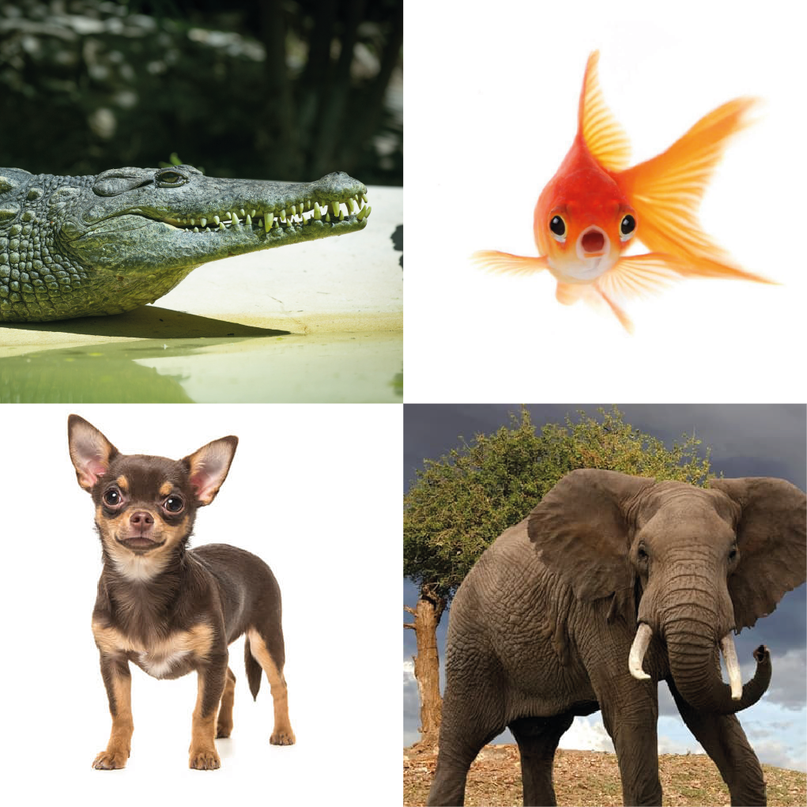

<!--
*** This README.md file was inspired by the 'Best-README-Template' of Othneil Drew.
*** See https://github.com/othneildrew/Best-README-Template.
-->

<!-- PROJECT SHIELDS -->
<!--
*** I'm using markdown "reference style" links for readability.
*** Reference links are enclosed in brackets [ ] instead of parentheses ( ).
*** See the bottom of this document for the declaration of the reference variables
*** for contributors-url, forks-url, etc. This is an optional, concise syntax you may use.
*** https://www.markdownguide.org/basic-syntax/#reference-style-links
-->
[![MIT License][license-shield]][license-url]
[![LinkedIn][linkedin-shield]][linkedin-url]
[![Gmail][gmail-shield]][gmail-url]

<!-- PROJECT LOGO -->
 

  
  <h3 align="center">CNN to recognize an animal</h3>

  

    In this project we use different CNN models to recognize an animal.
  

Remaining of the README to write...

<!-- MARKDOWN LINKS & IMAGES -->
<!-- https://www.markdownguide.org/basic-syntax/#reference-style-links -->
[license-shield]: https://img.shields.io/github/license/othneildrew/Best-README-Template.svg?style=for-the-badge
[license-url]: ./LICENSE.txt
[linkedin-shield]: https://img.shields.io/badge/-LinkedIn-black.svg?style=for-the-badge&logo=linkedin&colorB=555
[linkedin-url]: https://www.linkedin.com/in/anthony-david-ad28/
[gmail-shield]: https://img.shields.io/badge/Gmail-D14836?style=for-the-badge&logo=gmail&logoColor=white
[gmail-url]: mailto:anthony.david.phy@gmail.com
[Python]: https://img.shields.io/badge/python-3670A0?style=for-the-badge&logo=python&logoColor=ffdd54
[Python-url]: https://www.python.org
[Jupyter]: https://img.shields.io/badge/jupyter-%23FA0F00.svg?style=for-the-badge&logo=jupyter&logoColor=white
[Jupyter-url]: https://jupyter.org
[TensorFlow]: https://img.shields.io/badge/TensorFlow-%23FF6F00.svg?style=for-the-badge&logo=TensorFlow&logoColor=white
[TensorFlow-url]: https://www.tensorflow.org/
[Keras]: https://img.shields.io/badge/Keras-%23D00000.svg?style=for-the-badge&logo=Keras&logoColor=white
[Keras-url]: https://keras.io
[PyTorch]: https://img.shields.io/badge/PyTorch-%23EE4C2C.svg?style=for-the-badge&logo=PyTorch&logoColor=white
[PyTorch-url]: https://pytorch.org
[scikit-learn]: https://img.shields.io/badge/scikit--learn-%23F7931E.svg?style=for-the-badge&logo=scikit-learn&logoColor=white
[scikit-learn-url]: https://scikit-learn.org/
[Pandas]: https://img.shields.io/badge/pandas-%23150458.svg?style=for-the-badge&logo=pandas&logoColor=white
[Pandas-url]: https://pandas.pydata.org
[NumPy]: https://img.shields.io/badge/numpy-%23013243.svg?style=for-the-badge&logo=numpy&logoColor=white
[NumPy-url]: https://numpy.org
[Matplotlib]: https://img.shields.io/badge/Matplotlib-%23ffffff.svg?style=for-the-badge&logo=Matplotlib&logoColor=black
[Matplotlib-url]: https://matplotlib.org
[Plotly]: https://img.shields.io/badge/Plotly-%233F4F75.svg?style=for-the-badge&logo=plotly&logoColor=white
[Plotly-url]: https://plotly.com/python/
