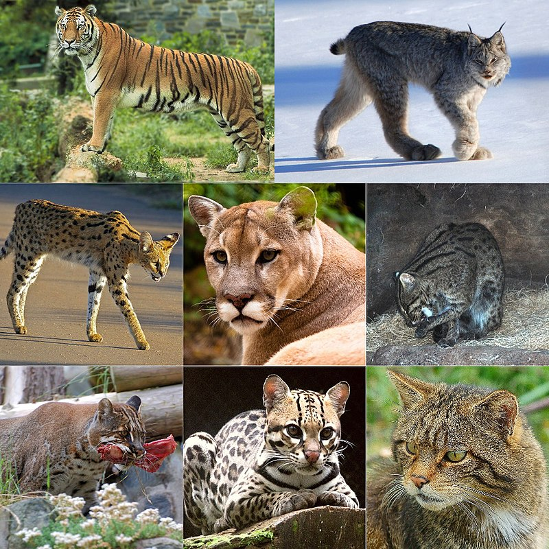

<a name="readme-top"></a>
<!--
*** This README.md file was inspired by the 'Best-README-Template' of Othneil Drew.
*** See https://github.com/othneildrew/Best-README-Template.
-->

<!-- PROJECT SHIELDS -->
<!--
*** I'm using markdown "reference style" links for readability.
*** Reference links are enclosed in brackets [ ] instead of parentheses ( ).
*** See the bottom of this document for the declaration of the reference variables
*** for contributors-url, forks-url, etc. This is an optional, concise syntax you may use.
*** https://www.markdownguide.org/basic-syntax/#reference-style-links
-->
[![MIT License][license-shield]][license-url]
[![LinkedIn][linkedin-shield]][linkedin-url]
[![Gmail][gmail-shield]][gmail-url]


<!-- PROJECT LOGO -->
<br />
<div align="center">
  <a href="https://github.com/akdavid/AI_projects/tree/main/CNN_felidae">
    
  </a>
  <h3 align="center">CNN to recognize a felidae by using transfer learning and fine-tuning</h3>

  <p align="center">
    In this project we take the CNN model 'MobileNetV2' to recognize a felidae by using transfer learning and fine-tuning.
  </p>
</div>


<!-- TABLE OF CONTENTS -->
<details>
  <summary>Table of Contents</summary>
  <ol>
    <li>
      <a href="#about-the-project">About The Project</a>
      <ul>
        <li><a href="#objectives">Objectives</a></li>
        <li><a href="#what-we-are-going-to-do">What we are going to do</a></li>
        <li><a href="#built-with">Built With</a></li>
      </ul>
    </li>
    <li><a href="#getting-started">Getting Started</a></li>
    <li><a href="#license">License</a></li>
    <li><a href="#contact">Contact</a></li>
    <li><a href="#acknowledgments">Acknowledgments</a></li>
  </ol>
</details>


<!-- ABOUT THE PROJECT -->
## About The Project

This project is part of the [AI Projects](http://github.com/akdavid/AI_projects) repository.

### Objectives:

 - Use a collection of convolutional neural network models to recognize an animal. 
 - Use data augmentation and different type of image processing with skimage.
 - Show a report of the different models to see which one is the best.


### What we're going to do:

 - Data scraping with a chrome extension for Google images
 - Preparation of data: resize the images and use data augmentation
 - Transfer learning from MobileNetV2: create the base model, freeze the convolutional base, add a classification head, train the model
 - Fine-tuning: Un-freeze the top layers, continue training the model
 - Confusion matrix and predictions


<p align="right">(<a href="#readme-top">back to top</a>)</p>


### Built With

This project have been built using the following frameworks and libraries: 
* [![Python][Python]][Python-url]
* [![Jupyter][Jupyter]][Jupyter-url]
* [![TensorFlow][TensorFlow]][TensorFlow-url]
* [![Keras][Keras]][Keras-url]
* [![scikit-learn][scikit-learn]][scikit-learn-url]
* [![Pandas][Pandas]][Pandas-url]
* [![NumPy][NumPy]][NumPy-url]
* [![Matplotlib][Matplotlib]][Matplotlib-url]


<p align="right">(<a href="#readme-top">back to top</a>)</p>


<!-- GETTING STARTED -->
## Getting Started

You can get this project by downloading the [directory](https://github.com/akdavid/AI_projects/tree/main/CNN_felidae) using [download-directory](https://download-directory.github.io) or [DownGit](https://minhaskamal.github.io/DownGit) for example.

In this directory there is an _environment.yml_ file that you can use to create the appropriate conda environment. If so, you need to install [miniconda](https://docs.conda.io/en/latest/miniconda.html) if you don't have it.

To create a conda environment from the _environment.yml_ file you have to `cd` in the project's directory and then use the following:
```console 
conda env create -f environment.yml
```

Finally, activate the environment with `conda activate CNN-felidae` and run `jupyter lab` to use the Notebook.

<p align="right">(<a href="#readme-top">back to top</a>)</p>


<!-- LICENSE -->
## License

Distributed under the MIT License. See [LICENSE.txt](./LICENSE.txt) for more information.

<p align="right">(<a href="#readme-top">back to top</a>)</p>


<!-- CONTACT -->
## Contact

[Anthony DAVID](https://anthonydavid3.wordpress.com) - [https://www.linkedin.com/in/anthony-david-ad28/](https://www.linkedin.com/in/anthony-david-ad28/) - anthony.david.phy@gmail.com

Repository Link: [https://github.com/akdavid/AI_projects](https://github.com/akdavid/AI_projects)

<p align="right">(<a href="#readme-top">back to top</a>)</p>


<!-- ACKNOWLEDGMENTS -->
## Acknowledgments

I would like to thank the authors of the following resources who helped me complete this project:

* [Formation Introduction au Deep Learning (FIDLE)](https://fidle.cnrs.fr)
* [TensorFlow Tutorials](https://www.tensorflow.org/tutorials)
* [Anis AYARI GitHub (Defend Intelligence)](https://github.com/anisayari)

<p align="right">(<a href="#readme-top">back to top</a>)</p>


<!-- MARKDOWN LINKS & IMAGES -->
<!-- https://www.markdownguide.org/basic-syntax/#reference-style-links -->
[license-shield]: https://img.shields.io/github/license/othneildrew/Best-README-Template.svg?style=for-the-badge
[license-url]: ./LICENSE.txt
[linkedin-shield]: https://img.shields.io/badge/-LinkedIn-black.svg?style=for-the-badge&logo=linkedin&colorB=555
[linkedin-url]: https://www.linkedin.com/in/anthony-david-ad28/
[gmail-shield]: https://img.shields.io/badge/Gmail-D14836?style=for-the-badge&logo=gmail&logoColor=white
[gmail-url]: mailto:anthony.david.phy@gmail.com
[Python]: https://img.shields.io/badge/python-3670A0?style=for-the-badge&logo=python&logoColor=ffdd54
[Python-url]: https://www.python.org
[Jupyter]: https://img.shields.io/badge/jupyter-%23FA0F00.svg?style=for-the-badge&logo=jupyter&logoColor=white
[Jupyter-url]: https://jupyter.org
[TensorFlow]: https://img.shields.io/badge/TensorFlow-%23FF6F00.svg?style=for-the-badge&logo=TensorFlow&logoColor=white
[TensorFlow-url]: https://www.tensorflow.org/
[Keras]: https://img.shields.io/badge/Keras-%23D00000.svg?style=for-the-badge&logo=Keras&logoColor=white
[Keras-url]: https://keras.io
[PyTorch]: https://img.shields.io/badge/PyTorch-%23EE4C2C.svg?style=for-the-badge&logo=PyTorch&logoColor=white
[PyTorch-url]: https://pytorch.org
[scikit-learn]: https://img.shields.io/badge/scikit--learn-%23F7931E.svg?style=for-the-badge&logo=scikit-learn&logoColor=white
[scikit-learn-url]: https://scikit-learn.org/
[Pandas]: https://img.shields.io/badge/pandas-%23150458.svg?style=for-the-badge&logo=pandas&logoColor=white
[Pandas-url]: https://pandas.pydata.org
[NumPy]: https://img.shields.io/badge/numpy-%23013243.svg?style=for-the-badge&logo=numpy&logoColor=white
[NumPy-url]: https://numpy.org
[Matplotlib]: https://img.shields.io/badge/Matplotlib-%23ffffff.svg?style=for-the-badge&logo=Matplotlib&logoColor=black
[Matplotlib-url]: https://matplotlib.org
[Plotly]: https://img.shields.io/badge/Plotly-%233F4F75.svg?style=for-the-badge&logo=plotly&logoColor=white
[Plotly-url]: https://plotly.com/python/
