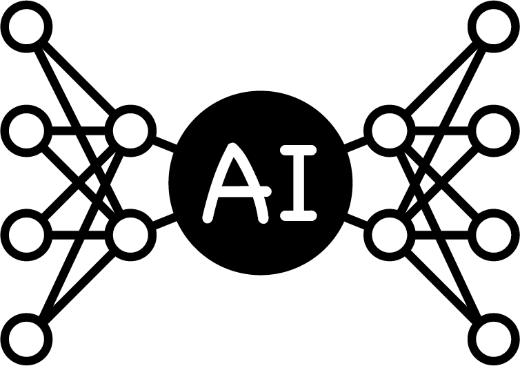

<a name="readme-top"></a>
<!--
*** This README.md file was inspired by the 'Best-README-Template' of Othneil Drew.
*** See https://github.com/othneildrew/Best-README-Template.
-->

<!-- PROJECT SHIELDS -->
<!--
*** I'm using markdown "reference style" links for readability.
*** Reference links are enclosed in brackets [ ] instead of parentheses ( ).
*** See the bottom of this document for the declaration of the reference variables
*** for contributors-url, forks-url, etc. This is an optional, concise syntax you may use.
*** https://www.markdownguide.org/basic-syntax/#reference-style-links
-->
[![MIT License][license-shield]][license-url]
[![LinkedIn][linkedin-shield]][linkedin-url]
[![Gmail][gmail-shield]][gmail-url]


<!-- PROJECT LOGO -->
<br />
<div align="center">
  <a href="https://github.com/akdavid/AI_projects">
    
  </a>

  <h3 align="center">AI Projects</h3>

  <p align="center">
    This repo contains my AI projects.
  </p>
</div>


<!-- TABLE OF CONTENTS -->
<details>
  <summary>Table of Contents</summary>
  <ol>
    <li>
      <a href="#about-the-repo">About The Repo</a>
      <ul>
        <li><a href="#built-with">Built With</a></li>
        <li><a href="#the-projects">The Projects</a></li>
      </ul>
    </li>
    <li><a href="#getting-started">Getting Started</a></li>
    <li><a href="#project-ideas">Project Ideas</a></li>
    <li><a href="#license">License</a></li>
    <li><a href="#contact">Contact</a></li>
    <li><a href="#acknowledgments">Acknowledgments</a></li>
  </ol>
</details>


<!-- ABOUT THE PROJECT -->
## About The Repo

In this repository I share my projects on artificial intelligence (AI). I have also dedicated a section for some of my [project ideas](#project-ideas) that are not finished.

<p align="right">(<a href="#readme-top">back to top</a>)</p>


### Built With

The projects presented in this repo have been built using the following frameworks and libraries: 
* [![Python][Python]][Python-url]
* [![Jupyter][Jupyter]][Jupyter-url]
* [![TensorFlow][TensorFlow]][TensorFlow-url]
* [![Keras][Keras]][Keras-url]
* [![PyTorch][PyTorch]][PyTorch-url]
* [![scikit-learn][scikit-learn]][scikit-learn-url]
* [![Pandas][Pandas]][Pandas-url]
* [![NumPy][NumPy]][NumPy-url]
* [![Matplotlib][Matplotlib]][Matplotlib-url]
* [![Plotly][Plotly]][Plotly-url]

<p align="right">(<a href="#readme-top">back to top</a>)</p>


### The Projects

The different projects are listed below.

- Dense Neural Network (DNN) to estimate the price of a house in Bordeaux: [regression_prix_maisons_bordeaux](https://github.com/othneildrew/Best-README-Template/issues)
    - Data exploration and visualization with Pandas, Seaborn, and Plotly
    - Data preparation for the machine learning models
    - DNN model with Keras
    - DNN model with PyTorch
    - Random Forest model with scikit-learn
- DNN to estimate the price of a football player: (comming soon!)
- Convolutional Neural Network (CNN) to recognize an animal: (comming soon!)
    - Data scraping with a chrome extension for Google images
- CNN to recognize a felidae by using transfer learning and fine-tuning: (comming soon!)

_See the corresponding directories fore more informations._


<p align="right">(<a href="#readme-top">back to top</a>)</p>


<!-- GETTING STARTED -->
## Getting Started

You can clone the entire repository to have all projects or get a single project by downloading the corresponding folder. 

To download a single folder you can use [download-directory](https://download-directory.github.io) or [DownGit](https://minhaskamal.github.io/DownGit) for example.

In each project directory there is an _environment.yml_ file that you can use to create the appropriate conda environment. You thus need to install [miniconda](https://docs.conda.io/en/latest/miniconda.html) if you don't have it.

To create a conda environment from the _environment.yml_ file you have to `cd` in the project's directory and the use the following:
```console 
conda env create -f environment.yml
```

Finally, activate the environment following the console prompt and run `jupyter lab` to use the Notebooks.

<p align="right">(<a href="#readme-top">back to top</a>)</p>


<!-- PROJECT IDEAS -->
## Project Ideas

Here are some of my project ideas. The projects that are already done are detailed in the section ['The Projects'](#the-projects). 

- [x] Dense Neural Network (DNN) to estimate the price of a house in Bordeaux
- [x] DNN to estimate the price of a football player
- [x] Convolutional Neural Network (CNN) to recognize an animal
- [x] CNN to recognize a felidae by using transfer learning and fine-tuning
- [ ] Recommendation for access to a bank loan of a given amount (classification) / Estimate of authorized loan amount (regression)
- [ ] Graph Neural Network for a recommendation program (e.g. recommendation of friends on a social network)
- [ ] Recurrent Neural Network and/or Transformer to estimate the number of potential customers (e.g. predict the number of subscribers to a YouTube channel after 6 months of activity)
- [ ] Recurrent Neural Network and/or Transformer for sentiment analysis (e.g. classifying Amazon reviews between negative and positive)
  - perspective: automatic response based on positive or negative classification 


<p align="right">(<a href="#readme-top">back to top</a>)</p>


<!-- LICENSE -->
## License

Distributed under the MIT License. See the [LICENSE](LICENSE.txt) file for more information.

<p align="right">(<a href="#readme-top">back to top</a>)</p>


<!-- CONTACT -->
## Contact

[Anthony DAVID](https://anthonydavid3.wordpress.com) - [https://www.linkedin.com/in/anthony-david-ad28/](https://www.linkedin.com/in/anthony-david-ad28/) - anthony.david.phy@gmail.com

Repository Link: [https://github.com/akdavid/AI_projects](https://github.com/akdavid/AI_projects)

<p align="right">(<a href="#readme-top">back to top</a>)</p>


<!-- ACKNOWLEDGMENTS -->
## Acknowledgments

I've benefited from a number of resources to carry out my various projects. In particular, I'd like to thank the authors of the following resources:

* [Formation Introduction au Deep Learning (FIDLE)](https://fidle.cnrs.fr)
* [TensorFlow Tutorials](https://www.tensorflow.org/tutorials)
* [PyTorch Tutorials](https://pytorch.org/tutorials/)
* [Anis AYARI (Defend Intelligence)](https://github.com/anisayari)

<p align="right">(<a href="#readme-top">back to top</a>)</p>


<!-- MARKDOWN LINKS & IMAGES -->
<!-- https://www.markdownguide.org/basic-syntax/#reference-style-links -->
[license-shield]: https://img.shields.io/github/license/othneildrew/Best-README-Template.svg?style=for-the-badge
[license-url]: ./LICENSE.txt
[linkedin-shield]: https://img.shields.io/badge/-LinkedIn-black.svg?style=for-the-badge&logo=linkedin&colorB=555
[linkedin-url]: https://www.linkedin.com/in/anthony-david-ad28/
[gmail-shield]: https://img.shields.io/badge/Gmail-D14836?style=for-the-badge&logo=gmail&logoColor=white
[gmail-url]: mailto:anthony.david.phy@gmail.com
[Python]: https://img.shields.io/badge/python-3670A0?style=for-the-badge&logo=python&logoColor=ffdd54
[Python-url]: https://www.python.org
[Jupyter]: https://img.shields.io/badge/jupyter-%23FA0F00.svg?style=for-the-badge&logo=jupyter&logoColor=white
[Jupyter-url]: https://jupyter.org
[TensorFlow]: https://img.shields.io/badge/TensorFlow-%23FF6F00.svg?style=for-the-badge&logo=TensorFlow&logoColor=white
[TensorFlow-url]: https://www.tensorflow.org/
[Keras]: https://img.shields.io/badge/Keras-%23D00000.svg?style=for-the-badge&logo=Keras&logoColor=white
[Keras-url]: https://keras.io
[PyTorch]: https://img.shields.io/badge/PyTorch-%23EE4C2C.svg?style=for-the-badge&logo=PyTorch&logoColor=white
[PyTorch-url]: https://pytorch.org
[scikit-learn]: https://img.shields.io/badge/scikit--learn-%23F7931E.svg?style=for-the-badge&logo=scikit-learn&logoColor=white
[scikit-learn-url]: https://scikit-learn.org/
[Pandas]: https://img.shields.io/badge/pandas-%23150458.svg?style=for-the-badge&logo=pandas&logoColor=white
[Pandas-url]: https://pandas.pydata.org
[NumPy]: https://img.shields.io/badge/numpy-%23013243.svg?style=for-the-badge&logo=numpy&logoColor=white
[NumPy-url]: https://numpy.org
[Matplotlib]: https://img.shields.io/badge/Matplotlib-%23ffffff.svg?style=for-the-badge&logo=Matplotlib&logoColor=black
[Matplotlib-url]: https://matplotlib.org
[Plotly]: https://img.shields.io/badge/Plotly-%233F4F75.svg?style=for-the-badge&logo=plotly&logoColor=white
[Plotly-url]: https://plotly.com/python/
